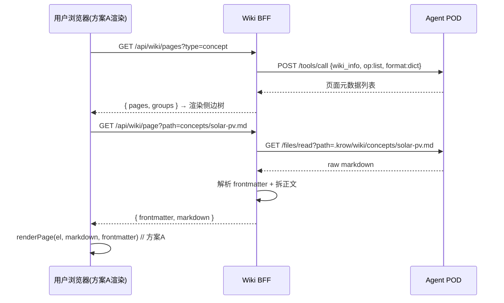
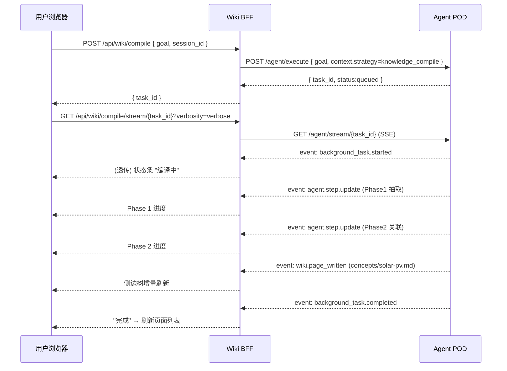
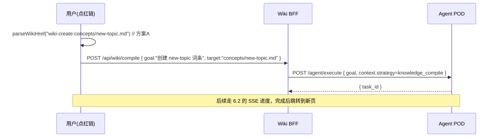

# 方案 C · Wiki BFF REST API 规范（基于现有 Agent POD）

> Web Wiki 的**后端不应复用桌面**（桌面是 Qt 进程内 `KnowledgeAPI` + 本地文件）。
> 而应基于 **Agent POD（headless 容器）**，在其之上加一层薄薄的 **Wiki BFF**
> （Backend-for-Frontend），把"通用 Agent / tools / files 接口"封装成 Web 友好的
> "wiki 一等公民 REST"。本文给出 BFF 应暴露的接口契约 + 它如何映射到 POD 现有接口 + 端到端序列图。

---

## 1. 为什么需要 BFF（而不是前端直连 POD）

Agent POD 现有接口是**通用**的，对 wiki 场景不够直接：

| 现有 POD 能力 | 对 wiki 的不足 |
| --- | --- |
| `POST /api/v1/agent/execute` + `GET /api/v1/agent/stream/{task_id}` | 通用 agent 执行，没有"wiki 页列表/搜索/单页"语义 |
| `POST /api/v1/tools/call`（`wiki_info`） | 暴露的是工具协议，前端要拼 `{tool, args}`，且返回需二次整形 |
| `GET /api/v1/files/read?path=.krow/wiki/...` | 拿到的是 raw markdown，前端要自己解析 frontmatter |
| `/api/v1/knowledge/*` | ⚠️ 是旧版向量库，**与 `.krow/wiki` 是两套系统，勿用** |

BFF 的价值：把上述拼装/整形/鉴权/多租户路由收敛到一处，前端只面对干净的 `/wiki/*` REST。

---

## 2. BFF 暴露的接口契约（建议）

所有接口 `Content-Type: application/json`；鉴权见 §5。路径前缀 `/api/wiki`。

### 2.1 列出页面（侧边树 / dashboard）

```
GET /api/wiki/pages?type=concept&q=&limit=200
```
响应：
```json
{
  "pages": [
    {
      "path": "concepts/solar-pv.md",
      "title": "太阳能光伏发电原理",
      "type": "concept",
      "confidence": "high",
      "updated": "2026-04-12",
      "tier": "essay",
      "stub": false
    }
  ],
  "groups": { "concepts": 12, "entities": 8, "sources": 7, "comparisons": 2, "overview": 1 }
}
```
映射：POD `POST /tools/call {tool:"wiki_info", args:{operation:"list", format:"dict"}}`。

### 2.2 读取单页（词条详情）

```
GET /api/wiki/page?path=concepts/solar-pv.md
```
响应：
```json
{
  "path": "concepts/solar-pv.md",
  "frontmatter": { "title": "...", "type": "concept", "sources": ["..."], "confidence": "high" },
  "markdown": "# 太阳能光伏发电原理\n\n光伏效应是...",
  "exists": true
}
```
映射：POD `GET /files/read?path=.krow/wiki/concepts/solar-pv.md` → BFF 解析 frontmatter +
正文拆分返回。前端拿到后交给**方案 A** `renderPage(el, markdown, frontmatter)`。
`exists:false` 时前端走红链"创建此页"。

### 2.3 全文搜索

```
GET /api/wiki/search?q=光伏&limit=20
```
响应：
```json
{ "results": [ { "path": "concepts/solar-pv.md", "title": "...", "type": "concept", "snippet": "...光伏效应..." } ] }
```
映射：POD `POST /tools/call {tool:"wiki_info", args:{operation:"search", query:"光伏", limit:20, format:"dict"}}`。

### 2.4 相关页面 / 邻居（related-pages）

```
GET /api/wiki/neighbors?path=concepts/solar-pv.md
```
响应：
```json
{ "outgoing": ["entities/vendor.md"], "incoming": ["comparisons/a-vs-b.md"], "related": ["concepts/semiconductor.md"] }
```
映射：POD `wiki_info {operation:"neighbors", page:"..."}`。

### 2.5 校验 / 健康检查（可选，运营用）

```
GET /api/wiki/validate?path=
```
映射：POD `wiki_info {operation:"validate"}` → 矛盾/孤立页/红链/无源页报告。

### 2.6 触发编译（核心写入路径）

```
POST /api/wiki/compile
{
  "goal": "把本项目 docs/ 下的资料编译进百科",
  "session_id": "web-user-42-sess-1",
  "target": null            // 可选：仅补全/创建某页（配合 wiki-create/wiki-upgrade scheme）
}
```
响应：`{ "task_id": "...", "status": "queued" }`
映射：POD `POST /agent/execute`，`context.strategy = "knowledge_compile"`（三阶段语义编译）。

### 2.7 订阅编译进度（SSE 透传）

```
GET /api/wiki/compile/stream/{task_id}?verbosity=verbose
```
直接透传 POD `GET /agent/stream/{task_id}` 的 SSE，BFF 可选做事件**精简**（只转
wiki 相关事件给前端，见 §4）。

---

## 3. BFF → POD 接口映射总表

| BFF 接口 | POD 现有接口 | POD 工具/参数 |
| --- | --- | --- |
| `GET /wiki/pages` | `POST /api/v1/tools/call` | `wiki_info` op=`list` |
| `GET /wiki/page` | `GET /api/v1/files/read` | path=`.krow/wiki/<rel>` |
| `GET /wiki/search` | `POST /api/v1/tools/call` | `wiki_info` op=`search` |
| `GET /wiki/neighbors` | `POST /api/v1/tools/call` | `wiki_info` op=`neighbors` |
| `GET /wiki/validate` | `POST /api/v1/tools/call` | `wiki_info` op=`validate` |
| `POST /wiki/compile` | `POST /api/v1/agent/execute` | `context.strategy=knowledge_compile` |
| `GET /wiki/compile/stream/{id}` | `GET /api/v1/agent/stream/{id}` | SSE 透传 |

> `wiki_info` 工具支持的 operation：`list / info / validate / search / neighbors / path`，
> 统一支持 `format=dict` 拿结构化数据。

---

## 4. SSE 事件契约（编译进度）

POD SSE 帧格式（envelope）：
```
event: <type>
data: {"type": "<type>", "payload": { ... }}
```
wiki 编译相关的关键事件类型（BFF 建议只透传这些给前端）：

| 事件 type | 含义 | 前端动作 |
| --- | --- | --- |
| `background_task.queued` | 任务入队 | 状态条："排队中" |
| `background_task.started` | 编译开始 | 状态条："编译中" |
| `agent.step.update` | 步骤进度（含三阶段语义） | 更新 Phase 1/2/3 进度 |
| `agent.thinking.delta`（verbose） | LLM 思考流 | 可选展示 |
| `wiki.page_written` | 某页写盘完成 | 侧边树增量刷新该页 |
| `background_task.completed` | 编译完成 | 刷新页面列表，状态条："完成" |
| `background_task.failed` | 编译失败 | 报错 + 重试入口 |
| `pipeline.heartbeat`（30s）/ `: keepalive`（25s） | 保活 | 维持连接，避免代理 idle 断流 |

> ⚠️ 长连接经 Cloudflare(100s)/Nginx(60s)/ALB(60s) 等代理时注意 idle timeout；POD 已内置
> 心跳，BFF 透传时**不要**缓冲 SSE（关闭 proxy buffering）。

---

## 5. 鉴权与多租户

### 5.1 POD 鉴权（BFF → POD 之间）
- Agent / tools / files 接口：Bearer **Connection Code**（POD 启动时签发）。
- `/lifecycle/init`：Header `X-Krow-Pod-Init-Token`（K8s Secret 注入）。

### 5.2 多租户模型（关键架构决策）
POD 现有模型是 **"一 POD 一用户一项目"** + `POST /lifecycle/init` 初始化 workspace。
多用户 wiki 必须在 BFF/Service 层解决租户隔离，常见两种：

| 方案 | 描述 | 适用 |
| --- | --- | --- |
| **每租户一 POD** | BFF 维护 `user_id → pod endpoint` 路由表，按需拉起/回收 POD | 隔离强，资源开销大 |
| **共享 POD + 项目隔离** | 单 POD 多 project_root，每请求带 project 标识 | 资源省，需确认 POD 项目切换/隔离能力 |

> BFF 负责把 Web 端的"用户身份/项目"翻译成对应 POD 的 Connection Code + project_root。
> 前端不直接接触 POD 鉴权。

---

## 6. 端到端序列图

### 6.1 浏览已编译的 wiki



### 6.2 编译新资料（写入路径）+ 进度



### 6.3 红链建页（wiki-create scheme）



---

## 7. 两种后端落地路径（BFF 怎么接 POD）

### 路径 A（推荐）— BFF 调远程 Agent POD HTTP
BFF 是无状态服务，按租户路由到 POD 的 `/api/v1/*`。改造小、与现有云基础设施一致。
本文 §2–§6 即按此路径。

### 路径 B — BFF 进程内嵌 SDK
```bash
pip install krow-agent-sdk[ontology,remote]   # wiki 管线需 [ontology]
```
BFF 直接 `AgentBuilder().with_project_root(...).build()`，进程内 `agent.run_stream(...)`，
或参考 cookbook 的**确定性五段流水线**（更可靠，见 §8）。适合批处理编译 job，省去 POD 网络跳。

---

## 8. 强烈建议参考的后端范例：knowledge-wiki cookbook

本 cookbook（[`../`](../) 上级目录）是官方 SDK 侧 wiki 参考实现，**直接映射 BFF 的编译后端**。
它的关键经验（务必照搬）：

> 不靠"巨型 macro-ReACT 一把跑完"（易在 step 解析/重规划上空转），而是用**确定性代码**把
> 引擎里已验证可靠的**单发能力**串起来（TURBO 哲学：System 1 编排 + System 2 单发）：

```
0. 规划：scan_knowledge_sources        (System 1 · 零 LLM)
1. 抽取：extract_ontology_from_sources  (System 2 · 每文件一次 LLM)
2. 关联：link_ontology_relations        (System 2 · 一次 LLM 提关系)
3. 物化：materialize_wiki_pages         (System 1 · 零 LLM · 红链物化)
4. 验收：report_wiki_coverage           (System 1 · 零 LLM · 覆盖核对)
```

**SDK 场景必知的坑**：桌面端 wiki 物化由生命周期管理器自动触发，**SDK / POD 端必须显式调
materialize**，否则"本体抽完但 wiki 不丰富"（这是真实用户反馈的痛点）。若走
`POST /agent/execute` + `knowledge_compile` 策略，Phase 3（发布）由 agent 的
`smart_file_write` 完成；若走 cookbook 的确定性流水线，则需显式调 `materialize`。

cookbook 还演示了 4 个 SDK plugin（可直接用于 BFF 路径 B）：
- `KnowledgeWikiToolPlugin`（scan/extract/relate/materialize/coverage 五件套）
- `KnowledgeWikiACTPlugin`（`knowledge_wiki_studio` ACT）
- `WikiCoverageGate`（防"假编译"：本体抽完但词条没写 → fail-loud）
- `CompileProgressListener`（三阶段进度 → jsonl，可改成 SSE 推送）

---

## 9. 缺口与待确认项（清单）

| 项 | 状态 | 建议 |
| --- | --- | --- |
| Wiki 一等公民 REST | ❌ 需 BFF 自建 | 按 §2 实现 |
| MD→HTML 渲染 | ✅ 方案 A 已交付（前端做） | 用 `@krow/wiki-render` |
| 编译触发 + 进度 | ✅ POD 已有 | `agent/execute` + `agent/stream` |
| 显式 materialize | ⚠️ SDK 路径需注意 | 见 §8 |
| 多租户 / 项目路由 | ❌ 架构级 | BFF/Service 层解决，见 §5.2 |
| ontology infobox / 图谱 Web API | ❌ 缺 | 二期；`graph_analysis` 是 agent 工具非 HTTP 图接口 |
| 旧 `/knowledge/*` 误用 | ⚠️ | 明确禁止，走 `.krow/wiki` + `wiki_info` |

---

## 10. 关键参考

| 主题 | 参考 |
| --- | --- |
| Headless POD 部署 / 接口 | `docs/headless-deployment.md`（公开文档） |
| SDK wiki cookbook（后端范例） | 本 cookbook 上级目录 [`../README.md`](../README.md) |
| 方案 A 本地参考实现 | [`../wiki_preview.py`](../wiki_preview.py) |
| 编译 ACT / 工具 | 本 cookbook 的 `act_assets/knowledge_wiki_studio/` |
