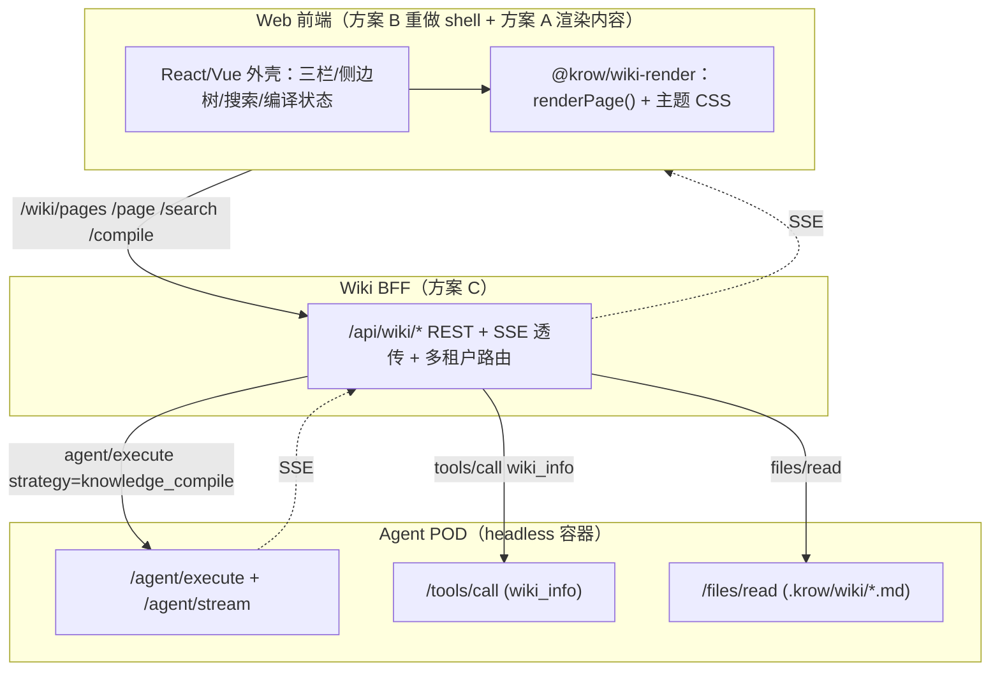

# 生产级 Web Handoff — 把 knowledge-wiki 搬上 Web（BFF + Web shell 接入指南）

> 交付对象：基于 Krow SDK / Agent POD 在自己的网站做 **Web 版 Wiki** 的外部开发者
> （以及 Krow Cloud 团队）。
> 目标：① 前端风格尽可能与桌面 Wiki 一致；② 最大化加速你的 Web 端研发。
> 一句话结论：**桌面 Wiki 前端无法整包搬到 Web（95% 是 Qt 外壳），但有一个高杠杆子集
> （内容渲染 + 视觉主题）可直接复用；后端走现有 Agent POD + 一层薄 BFF。**

这是 `knowledge-wiki` cookbook 的"上生产"扩展：cookbook 教你**怎么把资料编译成 wiki**，
本目录教你**怎么把编译好的 wiki 以与桌面一致的体验呈现在 Web 上**。

---

## 0. 核心结论与复用矩阵

桌面 WikiView = **PySide6 Qt 外壳 + QWebEngineView 内容区**的混合架构。真正"Web 可移植"
的资产只有约 443 行（2 个文件），恰好是决定**视觉一致性**的部分。

| 桌面层级 | 实现 | 体量 | 能否给 Web 复用 | 对应交付 |
| --- | --- | --- | --- | --- |
| 外壳 chrome（工具栏/三栏/侧边树/对话框/Toast/齿轮菜单） | PySide6 + QSS | ~3466 行 | ❌ 需重写 | 方案 B 规范 |
| 内容渲染引擎 | 原生 JS（QWebEngineView 内） | ~207 行 | ✅ 直接复用 | **方案 A** |
| 视觉主题 | CSS 变量 | ~236 行 | ✅ 直接复用 | **方案 A** |
| Markdown→HTML | Python `markdown-it-py` | — | ⚠️ 移植成 JS `markdown-it`（同源库，近 1:1） | 方案 A 已含 |
| 信息架构/交互契约 | 编码在 Qt 代码里 | — | ⚠️ 作设计规范复用 | 方案 B |
| 后端（编译/查询） | 进程内 `KnowledgeAPI`/文件 | — | ❌ 不复用，走 POD | 方案 C |

---

## 1. 三块交付物（A + B + C）

### 方案 A — Wiki 渲染套件（最高杠杆，直接保证视觉一致）

官方框架无关渲染套件 `@krow/wiki-render`（与桌面 WikiView 内容区**同源**）：

- `wiki-theme.css` — 内容区主题（来源桌面 SSOT，逐字一致）
- `wiki-render.js` — 框架无关渲染引擎（Markdown→HTML + callout/mermaid/echarts/katex/highlight
  后处理 + TOC + 链接 scheme 解析）
- `demo.html` — 双击即可运行的最小样例

→ 前端 `import` 即用，词条渲染**天然与桌面视觉一致**。

> 📦 **获取方式**（MIT 许可，自助获取，按优先级任选其一）：
> 1. **本文档仓**：[`packages/wiki-render/`](../../../../packages/wiki-render/) 目录直接
>    vendor 进你的前端工程（`wiki-render.js` + `wiki-render.d.ts` + `wiki-theme.css`）；
> 2. **SDK wheel 随包资产**：`pip install krow-agent-sdk` 后，
>    `python -c "from krow_agent_sdk.assets import get_wiki_render_dir; print(get_wiki_render_dir())"`
>    打印资产目录，复制即用。
> 本 cookbook 同目录的 [`../wiki_preview.py`](../wiki_preview.py)（零 LLM）演示了如何用
> 同源渲染逻辑把 `.krow/wiki/**/*.md` 生成一个可离线打开的静态站点
> `output/wiki_preview/index.html`——这是方案 A 在本地最直接的参考实现，可先用它验证视觉
> 效果（它会自动按 monorepo → SDK wheel → `KROW_WIKI_RENDER_DIR` 环境变量定位渲染资产）。

### 方案 B — 前端信息架构与交互契约规范

文档 [`01-frontend-architecture.md`](./01-frontend-architecture.md)：把藏在 ~3466 行 Qt 代码里的
产品设计提炼成框架无关规范——三栏布局、页面类型枚举、frontmatter 契约、4 种链接 scheme、
related-pages/infobox、侧边树/搜索/编译状态、明确的"不复用"边界、MVP 落地清单。用
React/Vue 照此重做外壳。

### 方案 C — Wiki BFF REST API 规范

文档 [`02-bff-api-spec.md`](./02-bff-api-spec.md)：后端不复用桌面，基于现有 Agent POD 加一层薄
BFF，把通用 `agent/tools/files` 接口封装成 wiki 一等公民 REST（`/wiki/pages`、`/page`、
`/search`、`/neighbors`、`/compile` + SSE 进度）。含 BFF→POD 映射总表、SSE 事件契约、
多租户模型、3 张端到端序列图、cookbook 后端范例、缺口清单。

---

## 2. 推荐落地架构（A + B + C 如何拼）



数据落点不变：`.krow/wiki/**/*.md`（词条）+ `.krow/ontology/global.db`（结构层 SSOT）。

---

## 3. 建议的实施顺序（最快见效）

1. **第 1 周**：前端集成 `@krow/wiki-render`，跑通 `demo.html`（或本 cookbook 的
   `wiki_preview.py`），确认视觉与桌面一致。
2. **第 1–2 周**：BFF 实现 `GET /wiki/pages` + `GET /wiki/page` + `GET /wiki/search`（只读路径），
   前端按方案 B 搭三栏 + 侧边树 + 词条页 → **可浏览已有 wiki**（先用一个 seed 项目验证）。
3. **第 2–3 周**：BFF 实现 `POST /wiki/compile` + SSE 透传，前端加编译触发 + 进度条 →
   **打通写入路径**。强烈建议后端参考 `knowledge-wiki` cookbook 的确定性五段流水线（见方案 C §8）。
4. **第 3 周+**：4 种链接 scheme 路由（含红链建页）、多租户 POD 路由。
5. **二期**：infobox（ontology 结构化）、taxonomy 侧边树、知识图谱视图。

---

## 4. 风险与治理（务必读）

- **SSOT 漂移（最重要）**：方案 A 是从桌面同源的渲染套件。若你 fork 后各自维护，半年必分叉。
  务必把 `@krow/wiki-render` 当**只读依赖**升级，不要手改其 `wiki-theme.css`（它以桌面主题为
  唯一 SSOT）。
- **别误用旧 knowledge API**：POD 的 `/api/v1/knowledge/*` 是旧版向量库，与 `.krow/wiki`
  ontology 管线是两套系统。Web Wiki 必须走 `agent + wiki_info + files`。
- **SDK 需显式 materialize**：桌面自动物化 wiki，SDK/POD 路径要确保 Phase 3 发布真的写盘
  （否则"本体抽完但词条不丰富"）。详方案 C §8。
- **依赖 extra**：wiki 管线需 SDK `[ontology]`（networkx/jieba 等），仅 core 不够。
- **多租户**：POD 是"一 POD 一用户一项目"，多用户站点需在 BFF/Service 层做租户隔离（架构级，
  非前端复用能解决）。详方案 C §5.2。
- **SSE 长连接**：注意 Cloudflare/Nginx/ALB 的 idle timeout；POD 已内置心跳，BFF 透传时关闭
  proxy buffering。

---

## 5. 目录索引

```
web-handoff/                          # 本目录：生产 Web Handoff 交接文档
├── README.md                         # 本文（总览 + 复用矩阵 + 落地架构 + 治理）
├── 01-frontend-architecture.md       # 方案 B：前端信息架构与交互契约
└── 02-bff-api-spec.md                # 方案 C：Wiki BFF REST API 规范（含序列图）

../wiki_preview.py                    # 方案 A 的本地参考实现（零 LLM 静态站点）
packages/wiki-render/                 # 方案 A：官方框架无关渲染套件（MIT · 本仓直接 vendor）
```

## 6. 关键参考

| 主题 | 参考 |
| --- | --- |
| Headless POD 部署 / 接口 | `docs/headless-deployment.md`（公开文档） |
| SDK wiki cookbook（后端范例） | 本 cookbook 根目录 [`../README.md`](../README.md) |
| 方案 A 本地参考实现 | [`../wiki_preview.py`](../wiki_preview.py) |
| 编译策略 / 工具 | 本 cookbook 的 `act_assets/knowledge_wiki_studio/` |
